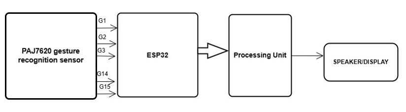
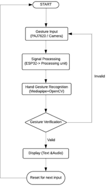
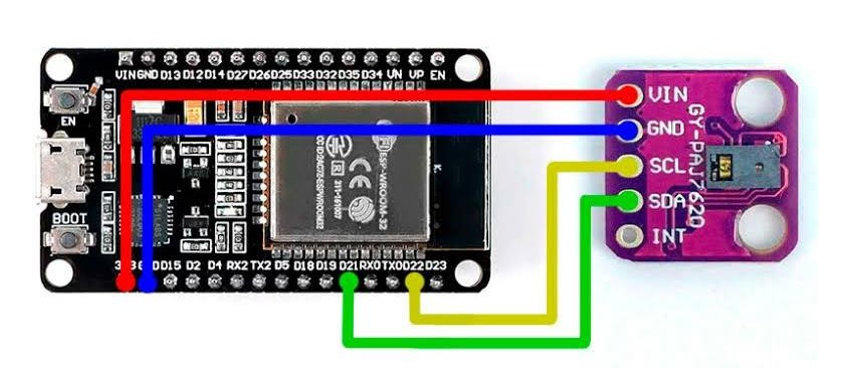
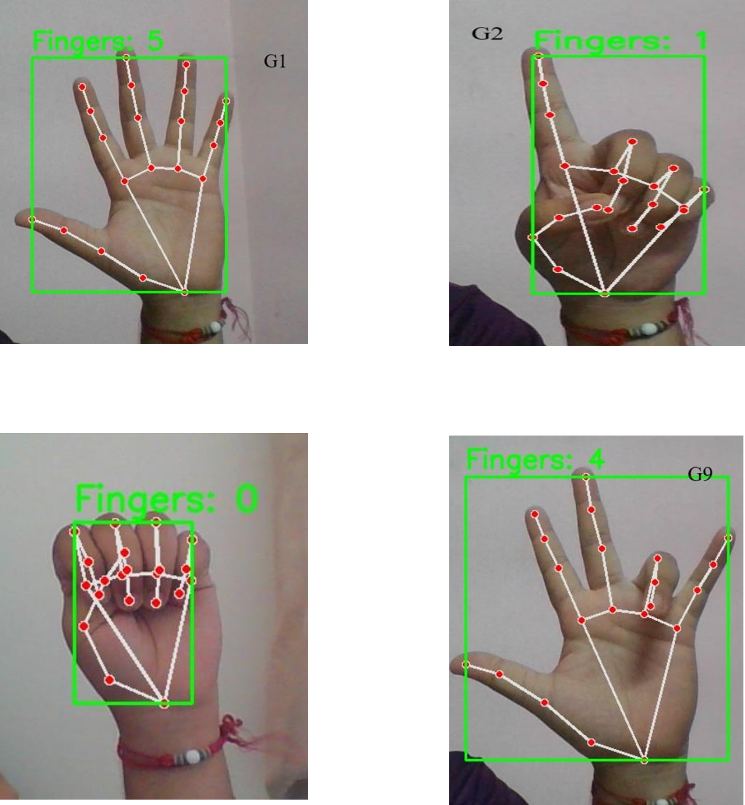

# Kannada Vachaka – Sign Language Translator 🤟🗣️

This project aims to assist the hearing and speech impaired by translating hand gestures into Kannada speech output. Built using ESP32, the PAJ7620 gesture sensor, and OpenCV for dual recognition.

---

## 🔧 Hardware Components Used
- **ESP32 Development Board**
- **PAJ7620 Gesture Sensor**
- **LCD Display** (non-I2C)
- **DIP Switches**
- **Laptop** (for processing via OpenCV)

---

## 🧠 Features
- Recognizes **5 hand gestures using OpenCV**
- Recognizes **9 gestures using PAJ7620 gesture sensor**
- **Converts gesture inputs into Kannada speech output**
- Uses **DIP switches** to toggle sensor modes and options

---

## 💡 Goals
- Assist in communication for the deaf and mute
- Make translation affordable and accessible
- Support native languages like **Kannada**

---

## 🔧 Block Diagram

---

## 🔄 Flowchart

---

## 🔄 Connection

---

## 🚀 Future Scope
- Replace laptop processing with **Raspberry Pi**
- Add **gesture-based alphabets and numbers**
- Include **voice feedback** or vibration alerts
- Multi-language support

---

## ✨ Status
> Work in Progress 🔧 | Half the gesture recognition complete

---

## 📷 Demo / Images

---

## 👩‍💻 Developed by
**Kshithi** – ECE Engineer passionate about embedded systems, societal impact, and coding cool stuff 💥
