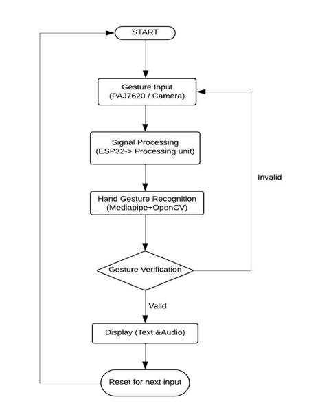

# Kannada Vachaka – Sign Language Translator 🤟🗣️

This project aims to assist the hearing and speech impaired by translating hand gestures into Kannada speech output. Built using ESP32, the PAJ7620 gesture sensor, and OpenCV for dual recognition.

---

## 🔧 Hardware Components Used
- **ESP32 Development Board**
- **PAJ7620 Gesture Sensor**
- **Laptop** (for processing via OpenCV)

---

## 🧠 Features
- Recognizes **5 hand gestures using OpenCV**
- Recognizes **9 gestures using PAJ7620 gesture sensor**
- **Converts gesture inputs into Kannada speech output**

---

## 💡 Goals
- Assist in communication for the deaf and mute
- Make translation affordable and accessible
- Support native languages like **Kannada**

---

## 🔧 Block Diagram

---

## 🔄 Flowchart

---

## 🔄 Connection

---
## 📦 Implementation Details

For full implementation steps, [click here to view the Implementation.md file](./implementation.md).

---

## 🚀 Future Scope
- Replace laptop processing with **Raspberry Pi**
- Add **gesture-based alphabets and numbers**
- Include **voice feedback** or vibration alerts
- Multi-language support

---

## ✨ Status
- To make it easy, I have divded the code into two sections.
- Intially, developed code for just finger count - [the finger count code is here](./fingercount.py).
- Later on the entire code for the project was written, keeping in mind inputs and outputs [Final and Complete code of the project](./project_code.py).

---

## 📷 Demo / Images
-Finger Count on OpenCV

-Text recognition of corresponding gestures

---

## 👩‍💻 Developed by
**Kshithi** – ECE Engineer passionate about embedded systems, societal impact, and coding cool stuff 💥
